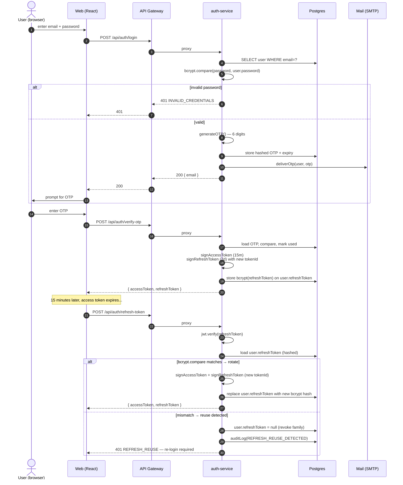
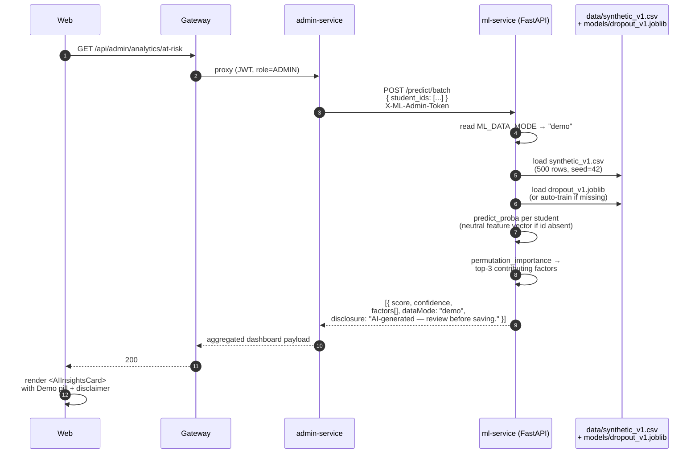
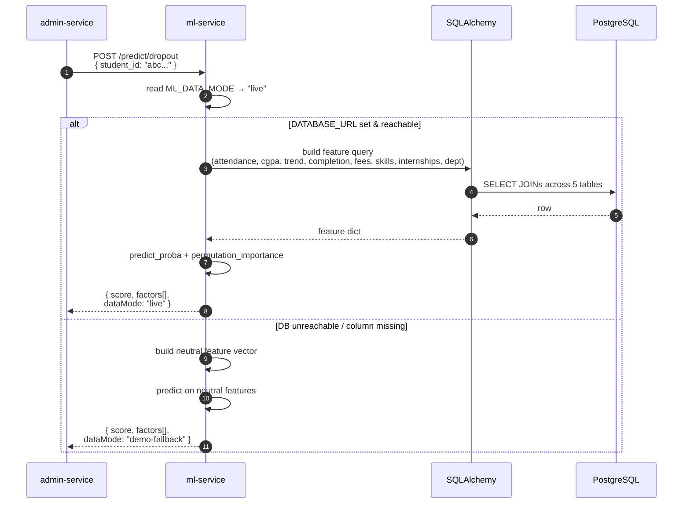
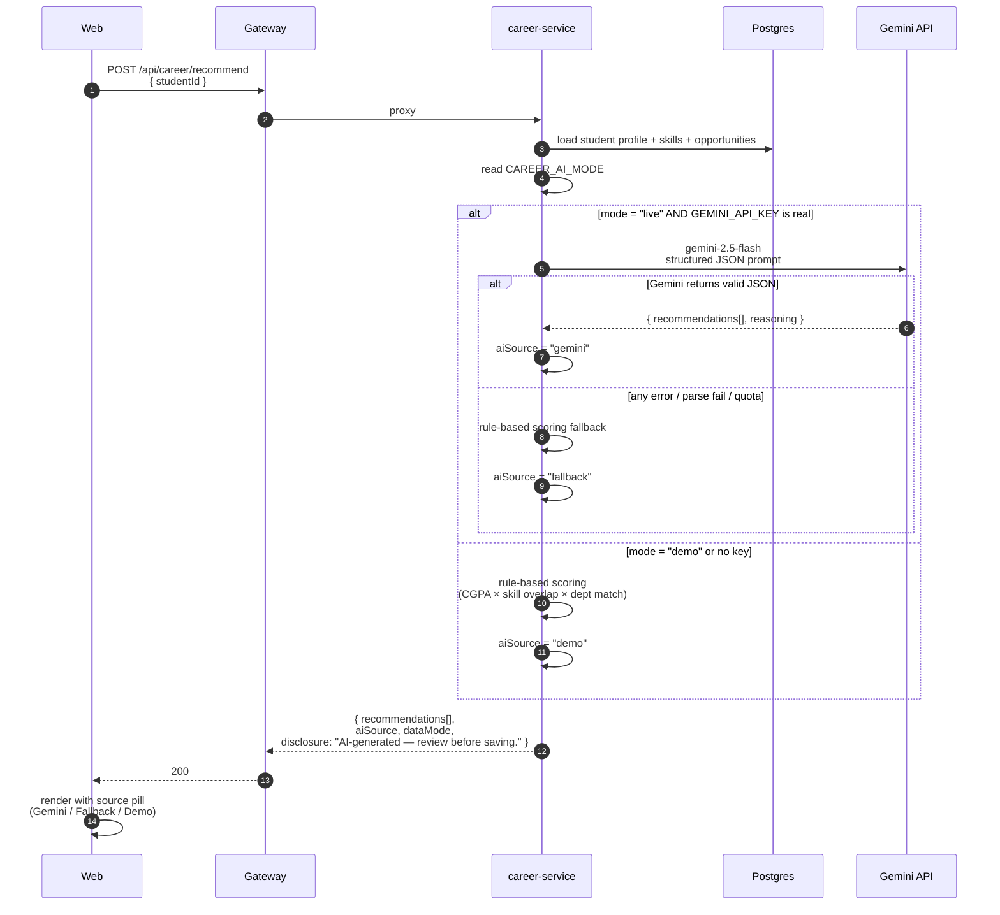
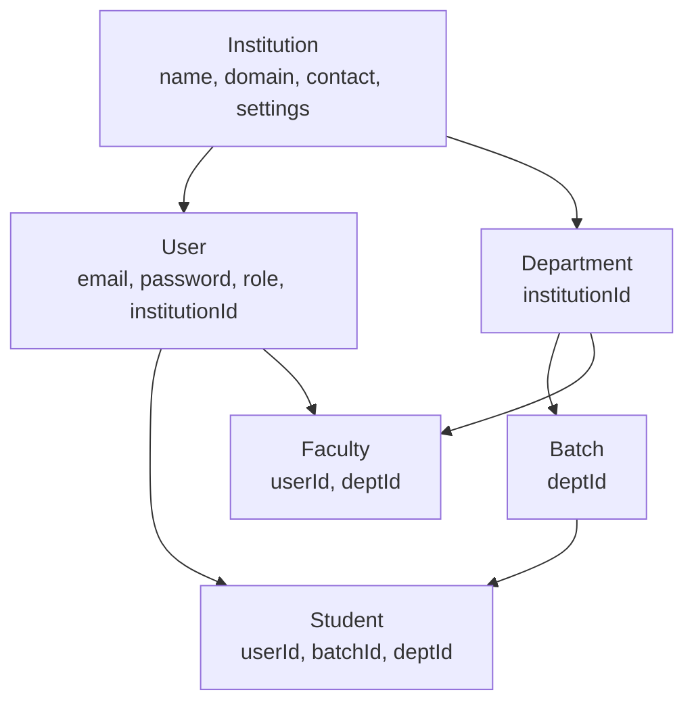

# ARCHITECTURE.md — Neural ERP

This document is the design companion to [README.md](./README.md). Read the README first
for the *what*; this file is the *how* and *why*.

---

## High-level system

```mermaid
flowchart LR
    subgraph Client
        Web[Web — React 19 / Vite]
    end

    Web -->|HTTPS / JWT bearer| GW[API Gateway :3000<br/>helmet, CORS, request-id,<br/>200/min global, 10/min auth,<br/>per-user 100/min]

    subgraph Node["Node 20 — npm workspaces"]
        Auth[auth :3001]
        Acad[academic :3002]
        Att[attendance :3003]
        TT[timetable :3004]
        Asg[assignment :3005]
        Gr[grade :3006]
        Car[career :3007]
        Notes[notes :3008]
        Fee[fee :3009]
        Lib[library :3010]
        Forum[forum :3011]
        Notif[notification :3012]
        Adm[admin :3013]
    end

    subgraph Python["Python 3.11"]
        ML[ml-service :3014<br/>FastAPI + scikit-learn]
    end

    GW --> Auth
    GW --> Acad
    GW --> Att
    GW --> TT
    GW --> Asg
    GW --> Gr
    GW --> Car
    GW --> Notes
    GW --> Fee
    GW --> Lib
    GW --> Forum
    GW --> Notif
    GW --> Adm
    GW --> ML

    Adm -->|X-ML-Admin-Token<br/>POST /predict/batch| ML

    Car -->|Gemini 2.5 Flash<br/>(when CAREER_AI_MODE=live)| Gem[(Google Gemini)]

    Auth --> PG[(PostgreSQL 15<br/>via Prisma)]
    Acad --> PG
    Att --> PG
    TT --> PG
    Asg --> PG
    Gr --> PG
    Car --> PG
    Notes --> PG
    Fee --> PG
    Lib --> PG
    Forum --> PG
    Notif --> PG
    Adm --> PG
    ML -->|live mode| PG

    GW --> Redis[(Redis 7<br/>cache + rate limit)]
    Auth --> Redis
    Acad --> Redis
    Adm --> Redis

    ML -.demo mode.-> CSV[synthetic_v1.csv<br/>500 rows, seed=42]
```

The gateway is a thin proxy. It does not own business logic — it stamps a request id,
applies rate limits, terminates CORS, and forwards to the right service based on the
URL prefix (`/api/auth/*` → auth-service, `/api/predictions/*` → ml-service, etc.).

---

## Auth flow

Login is a 2-step OTP flow. Refresh tokens rotate on every use and reuse is detected.



**Why hash refresh tokens at rest?** A DB dump leaks user IDs and email addresses but
not the bearer secret. The token in the leak is bcrypt-hashed, so an attacker would
need to brute-force each one — and reuse-detection means the moment a stolen old
token is presented, the entire family is revoked.

**Why OTP for login (not just for signup)?** This is an institutional system; second-
factor every login is a defensible default for a portfolio piece. SMTP delivery is
optional in dev — the auth-service falls back to logging the OTP to stdout, which is
fine locally and will not happen in production because `requireEnv` gates the boot.

---

## AI prediction flow — Demo mode

`ML_DATA_MODE=demo` (default).



**Why ship a synthetic dataset?** Anyone cloning the repo gets working AI immediately
without seeding the DB or wiring real student data. The dataset is generated
deterministically (`np.random.seed(42)`) so test assertions on AUC are stable.

**Why permutation importance and not feature_importances_ / coef_?**
Permutation importance is model-agnostic, runs over the held-out test set, and yields
human-readable raw feature names (`attendance_pct` instead of `num__attendance_pct`).
The web UI surfaces these as the "top 3 contributing factors" without the user ever
seeing scaler / one-hot encoder internals.

---

## AI prediction flow — Live mode

`ML_DATA_MODE=live`.



The `demo-fallback` tag is what the Web UI uses to flip the badge from "Live" to
"Demo (fallback)" so reviewers know the prediction is not actually grounded in their
DB. This is a transparency contract, not a defensive nicety.

---

## Career recommendations flow

`career-service` exposes `POST /api/career/recommend`.



**Why a fallback at all?** A reviewer cloning the repo without a Gemini key still sees
useful, deterministic recommendations on the demo screen. The career service boots
clean in demo mode and the lazy Gemini client only initialises when a real key is
detected (string is non-empty, not the placeholder, not "your-api-key-here").

---

## Multi-tenancy boundary



Every business object hangs off `Institution`. Cross-tenant queries are a bug —
controllers should always scope by `req.user.institutionId` or by a path-derived
`institutionId`. The auth middleware attaches the full user (including
`institutionId`) to `req.user` so handlers don't need an extra DB round-trip.

`SUPER_ADMIN` is the only role that legitimately spans institutions — used for
platform-level operations and not exposed in the seeded demo accounts.

---

## Data model overview

The schema lives in [`backend/database/prisma/schema.prisma`](./backend/database/prisma/schema.prisma).
**31 models** and **11 enums**. High-level groupings:

- **Identity & tenancy:** `Institution`, `User`, `Student`, `Faculty`, `Department`, `Batch`.
- **Academic:** `Subject`, `FacultySubject`, `Attendance`, `TimetableSlot`, `Assignment`, `Submission`, `Grade`, `SemesterResult`, `Exam`.
- **Career:** `CareerOpportunity`, `CareerEvent`, `CareerApplication`, `StudentSkill`.
- **Resources:** `NoteFolder`, `Note`, `SharedNote`, `SmartboardNote`, `LibraryBook`, `BookIssue`.
- **Operations:** `Fee`, `Payment`, `ForumPost`, `ForumReply`, `Notification`, `Announcement`.
- **Audit / ML:** `AuditLog`, `Prediction`.

Enums: `Role`, `AttendanceStatus`, `AssignmentStatus`, `Day`, `FeeStatus`, `FeeType`,
`BookStatus`, `NotificationType`, `AnnouncementPriority`, `ExamType`, `SlotType`,
`PredictionType` (12 enums total — count differs by 1 because the README round number is
"~11", and the `PredictionType` enum lives next to the `Prediction` model rather than in
the top enum block).

The `Prediction` model is intentionally write-only from the Node side — `ml-service`
optionally persists predictions for audit and offline analysis but the live web UI
reads predictions directly from the ML service to keep latency low.

`AuditLog` is append-only. Every meaningful CRUD writes one row; the admin UI exposes a
paginated audit view.

---

## Why microservices?

This is a fair question to push back on. The honest answer:

**For the user.** The product is a single multi-tenant web app — there is no
independent scaling story. Postgres is the bottleneck either way. Microservices are
not the right call for a typical college-ERP team.

**For the project.** Splitting the backend into 13 services makes the system *legible*
in a way a monolith of equivalent feature surface area is not. Each service has 100–400
lines of route + controller code, its own validators, and a clear boundary. That makes
it easy for a recruiter to read one service end-to-end in five minutes, and it makes it
easy for a future contributor to onboard onto one service without learning the entire
domain. It also lets the ML service live in Python without dragging the Node side into
inter-process polyglot pain — they share Postgres and a typed JSON contract, nothing else.

**Trade-offs accepted:**
- More boot processes locally → mitigated by `concurrently` and `npm run dev`.
- More env vars → mitigated by a single `backend/.env` shared via npm workspaces.
- More boilerplate → mitigated by `shared/bootstrap/createApp` and shared middleware.
- Cross-service queries are awkward → mitigated by the gateway aggregating in
  `admin-service` (the dashboard endpoint joins data from 4 services).
- Distributed transactions are hard → not relevant here. Every business operation
  sits inside a single service's Postgres write.

If this were a real product with a small team, it would be a Modular Monolith with
the same internal boundaries (one Express app, 13 routers, 13 controller folders, 13
validator files). Same code, fewer processes. The microservice split is the
demonstration choice for portfolio purposes; the modular code structure is what
actually matters.

---

## Performance notes

- **Caching.** `cacheGet(key, loader, ttl)` is used for departments / subjects / batches
  (600s), timetables (300s), and the admin dashboard aggregate (120s). Every write
  invalidates the matching keys via `cacheInvalidate('prefix:*')`.
- **Lazy loading.** Every page-level React route is `React.lazy` + `<Suspense>`. The
  main JS chunk dropped from 694KB to 269KB with the AdminDashboard split out into
  its own 54KB chunk.
- **Pagination.** Forum 10/page, notifications 20/page, audit logs 25/page.
- **DB indexes.** Stock Prisma `@unique` and `@@index` declarations cover the hot read
  paths (`User.email`, `Attendance(studentId, date)`, `Grade(studentId, subjectId)`).

---

## See also

- [README.md](./README.md) — outward-facing overview.
- [DEPLOY.md](./DEPLOY.md) — every supported deployment path.
- [CLAUDE.md](./CLAUDE.md) — codebase conventions and "how to add X" recipes.
- [ROADMAP.md](./ROADMAP.md) — what's done and what's next.
