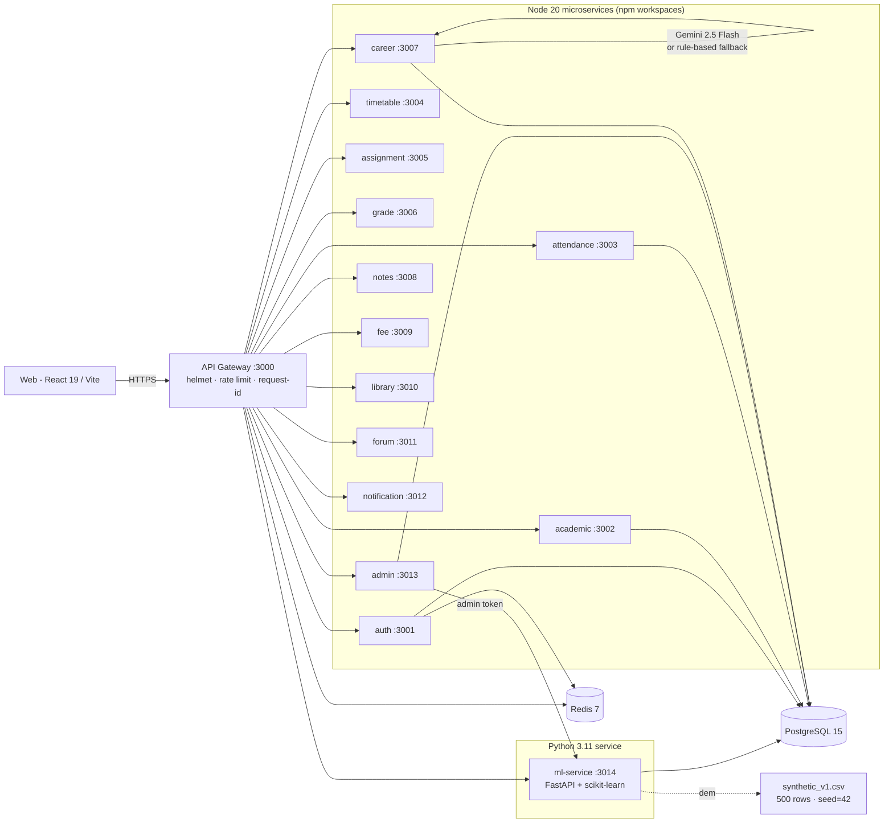

<div align="center">

# Neural ERP

**A multi-tenant institution management system that ships with real ML, transparent AI, and 14 services that actually run on day one.**

[](./.github/workflows/ci.yml)
[](#testing)
[](#tech-stack)
[](./LICENSE)
[](#aiml-the-interesting-part)

</div>

---

## Why use this

Most education ERPs are a CRUD admin panel and a payment integration with the words "AI-powered" stamped on the marketing site. Neural ERP is the opposite: an actual production-shaped microservice backend with two real ML models, transparent AI surfacing, and a development experience that runs on a fresh laptop in under five minutes.

Use this repo if any of these match:

- **You're an engineering reviewer / hiring manager** and you want to see *how* somebody designs a system, not just whether they can wire a button to an endpoint. Read [`ARCHITECTURE.md`](./ARCHITECTURE.md) and the auth flow in `backend/services/auth-service/` — the rotation/reuse-detection is real.
- **You're learning microservices** and tired of toy "todo-app split into 5 docker containers" examples. This is 14 services with shared utilities, npm workspaces, a real proxy gateway, and per-user rate limiting that actually works.
- **You're integrating ML into a Node backend** and want a reference for how the Python boundary looks. The Python service is a peer (port 3014) behind the same gateway, with a clean Demo↔Live data-mode toggle and `permutation_importance`-based explainability.
- **You teach or run a small institution** and the off-the-shelf ERPs are six-figure quotes. This is MIT-licensed and self-hostable on a single VPS.
- **You're an AI / ML engineer** and want to see the ethics rule applied in code: every prediction response carries `"AI-generated — review before saving."` plus a Demo/Live source pill. No silent magic.

It is *not* a replacement for a battle-tested SIS at scale (yet) — but it is a serious, opinionated reference for the architecture of one.

---

## What's new

The pieces that are not in a typical ERP repo:

| What | Where | Why it matters |
|---|---|---|
| **Real ML, not LLM cosplay** | `backend/services/ml-service/` | Two scikit-learn models trained on a 500-row deterministic synthetic dataset (seed=42). Dropout-risk: GradientBoosting wins 5-fold CV, **ROC-AUC 0.9292**. Placement-probability: RandomForest n=200, **ROC-AUC 0.8008**. Each prediction returns top-3 contributing factors via `permutation_importance`. |
| **Demo↔Live data toggle** | `ML_DATA_MODE=demo \| live` | Default `demo` ships with a synthetic CSV so anyone cloning the repo gets working AI without seeding the DB. Flip to `live` and the same endpoints assemble features from real Postgres rows. Falls back to `demo-fallback` and surfaces it in the response if the DB is unreachable. |
| **Gemini career recs *with* a fallback** | `career-service` | `CAREER_AI_MODE=demo` runs a rule-based scorer (no API key required). `live` calls Gemini 2.5 Flash with Google Search grounding. Any Gemini failure (quota, parse error, network) auto-falls-back to demo and stamps `aiSource: "rule-based-demo-fallback"` in the response. Reviewers without an API key still see useful output. |
| **Transparency baked in** | `web/src/components/AIInsightBadge.jsx` | Every AI-rendered surface in the UI is wrapped in a badge that shows the data source ("Demo" or "Live"), the timestamp, and the literal disclosure `"AI-generated — review before saving."`. Per the project's ethics rule. No exceptions. |
| **Dropout/Placement explainability** | `ml-service/src/models/predict.py` | Predictions don't just return a number — they return the top-3 features that pushed it that direction (e.g., `attendance_pct`, `cgpa`, `assignment_completion_pct`). Surfaced in the student dashboard. |
| **Auth that actually rotates** | `auth-service` | JWT access (15m) + refresh (7d). Refresh tokens are bcrypt-hashed at rest, rotated on every use. Reuse detection (presenting an already-rotated token) wipes the entire token family — every device is forced to re-login. Audit-logged. |
| **Validators everywhere** | `services/*/src/validators/*.validators.js` | 13 services have `express-validator` chains on every mutating endpoint. Unified 422 envelope. **43 dedicated validator tests** plus 80 existing unit tests = 132 jest cases across 15 suites. |
| **Audit log on every meaningful CRUD** | `shared/utils/auditLog.js` | Auth events, faculty CRUD, grade creation, attendance marking, refresh-reuse detection, plus the 8 services we extended in this sprint (career, notes, fee, library, forum, notification, timetable, assignment). Failures never propagate. |
| **One-command monorepo** | `npm workspaces` | 14 services share a single root `node_modules` and a single Prisma client. `npm run dev` boots the gateway and all 13 Node services concurrently. The Python ml-service runs in its own venv but is wired into the same gateway proxy. |
| **CI / Docker / nginx out of the box** | `.github/workflows/ci.yml`, `backend/docker-compose.prod.yml` | GitHub Actions runs backend, web, and ml-service tests in three parallel jobs. Per-service Dockerfile for every Node service. Production compose with nginx reverse proxy and resource-limit hooks. |
| **No fake data, no fake citations** | `ml-service/data/README.md`, all docs | The synthetic dataset is *clearly labelled* synthetic in code and docs. No real student records were used. No fabricated AI citations or imaginary metrics anywhere. |

---

## Make it run now

The fastest path to a running stack on a fresh machine. **Total wall-clock time: ~5 minutes** if you have Docker, Node 20, and Python 3.11+.

```bash
# 1. Clone
git clone https://github.com/va-ada/NEURAL-ERP.git neural-erp
cd neural-erp

# 2. Datastores via Docker (Postgres, Mongo, Redis, ML service)
cd backend
cp .env.example .env
docker compose up -d postgres mongodb redis ml-service

# 3. Backend dependencies + DB schema
npm install
npm run db:generate
npm run db:migrate
npm run db:seed
npm run dev    # boots api-gateway + 13 Node services

# 4. In a second terminal — web frontend
cd ../web
npm install
npm run dev    # http://localhost:5173

# 5. Log in (use the demo credentials below)
```

That's it. The browser opens at `http://localhost:5173`. Click **Sign In**, paste any of the [demo credentials](#demo-credentials), and you'll see:

- A **student dashboard** with an *AI Insights* card showing dropout-risk + placement-probability *for that student*, both labelled "Demo" with the AI disclosure.
- A **career page** with AI-recommended internships (rule-based by default, real Gemini if you set `CAREER_AI_MODE=live` + `GEMINI_API_KEY`).
- An **admin analytics tab** with a *predicted at-risk students* table sourced from the ML service.
- An **admin settings tab** showing the current AI data mode (Demo / Live).

> **Login uses 6-digit OTP.** In dev (no SMTP configured) the OTP is logged to the auth-service stdout — copy it from there into the OTP screen.

If you have no Docker, follow [Option B](#option-b--local-without-docker) below. For production deploys (Render free tier, single VPS via Docker Compose, Vercel/Netlify for the frontend) see [DEPLOY.md](./DEPLOY.md).

---

## Live demo

Hosted demo: **TBD** — the repo is self-deployable today via `docker compose -f backend/docker-compose.prod.yml up`. Once a public URL is live this section will link to it; until then the local quick-start above is the canonical way to evaluate the project.

## Screenshots

> Screenshots will land in `docs/screenshots/` once a public deploy is up. The local stack today already renders the AI Insights card, the at-risk students table, and the dark-mode dashboard — clone and run if you want to see them.

---

## Architecture



Sequence diagrams (auth flow, demo vs live ML, Gemini fallback, refresh-reuse detection) live in [ARCHITECTURE.md](./ARCHITECTURE.md).

---

## Tech stack

| Layer | Tech | Why |
|---|---|---|
| **Web** | React 19, Vite 7, React Router 7, Chart.js, framer-motion | React 19 + Vite gives sub-200ms HMR; Chart.js is small and Canvas-rendered (no SVG churn for analytics dashboards). |
| **Web tests** | Vitest 4, Testing Library, jsdom | Vitest reuses the Vite config, so dev and test environments stay in lockstep — no duplicate webpack/babel pipeline. |
| **Backend** | Node 20, Express 4, Prisma 5, npm workspaces | Workspaces let 14 services share a single `node_modules` and a single Prisma client. Express because it is uninteresting and that is a feature. |
| **Storage** | PostgreSQL 15, Redis 7 | Postgres for relational + transactional data; Redis for the per-user rate limiter and a TTL cache on hot reads (departments, batches, dashboards, career opportunities, assignments per batch). |
| **Auth** | JWT (access + refresh), bcrypt, 6-digit OTP via Nodemailer/SMTP | Refresh tokens are hashed at rest and rotated on every use; reuse is detected and revokes the family. |
| **Backend tests** | Jest 30, supertest 7 | Same runner across every workspace; supertest exercises Express handlers without booting a real port. |
| **ML service** | Python 3.11, FastAPI 0.115, scikit-learn 1.5, pandas, joblib | scikit-learn is small, deterministic, and explainable (`permutation_importance` gives top-3 contributing features per prediction). FastAPI for typed Pydantic schemas and async OpenAPI docs. |
| **ML tests** | pytest 8 | Three suites: synthetic dataset shape/balance, model AUC thresholds, FastAPI endpoint contracts. |
| **Infra** | Docker Compose (dev + prod), nginx, GitHub Actions | One-command local stack via `docker compose up -d`. Prod compose builds every service from source and fronts them with nginx (TLS via Caddy in front, see DEPLOY.md). |
| **AI** | Google Gemini 2.5 Flash (career), scikit-learn (predictions) | Gemini for free-form recommendations (with rule-based fallback so the demo works without a key); scikit-learn for ML so anyone with Python can re-train. |

---

## Features

### Core ERP

- **Authentication.** JWT access (15m) + refresh (7d). 6-digit OTP via SMTP for 2FA. Refresh tokens are bcrypt-hashed at rest and rotated on every refresh; reuse detection nukes the entire token family ([details](./ARCHITECTURE.md#auth-flow)).
- **Role-based access.** `SUPER_ADMIN`, `ADMIN`, `FACULTY`, `STUDENT`. Role-aware routing on the web and `authorize(...roles)` middleware on every protected backend route.
- **13 backend services.** auth, academic, attendance, timetable, assignment, grade, career, notes, fee, library, forum, notification, admin — each with its own Express app, validators, controllers, and routes. Plus the api-gateway and the Python ml-service.
- **Audit log.** Shared `auditLog()` utility writes to a Prisma `AuditLog` model on every meaningful CRUD (registration, faculty CRUD, grade creation, attendance marking, refresh-reuse, plus 19 new mutation sites added in this sprint). Failures never propagate.
- **Validators on every mutating endpoint.** `express-validator` chains live in `services/<svc>/src/validators/*.validators.js`, executed by a shared `validateRequest` middleware that emits a unified 422 envelope.
- **Per-user rate limiting.** Global 200/min in the gateway, strict 10/min on `/api/auth/*`, plus per-user 100/min keyed by user ID (falls back to IP). Auth service additionally rate-limits OTP attempts: 5 failed attempts per email per 15min → 429 `OTP_RATE_LIMITED`.

### AI / ML (the interesting part)

- **Dropout-risk prediction.** Picks the better of `LogisticRegression` vs `GradientBoostingClassifier` by 5-fold CV ROC-AUC. **Achieved ROC-AUC: 0.9292** on a 25% held-out split of the 500-row synthetic dataset. Returns `score`, `confidence`, and the **top 3 contributing factors** computed via `sklearn.inspection.permutation_importance` over the held-out test set.
- **Placement-probability prediction.** `RandomForestClassifier(n_estimators=200, random_state=42)`. **Achieved ROC-AUC: 0.8008**.
- **Career recommendations.** Gemini 2.5 Flash via `@google/genai` in `career-service`, with a rule-based scoring fallback so reviewers without a Gemini key still get useful output. `CAREER_AI_MODE=demo` (default, no API key needed) or `live` (Gemini, auto-falls-back to demo on any error).
- **Demo↔Live data toggle.** `ML_DATA_MODE=demo` ships with a 500-row synthetic CSV (`backend/services/ml-service/data/synthetic_v1.csv`, generated deterministically with `np.random.seed(42)`) so anyone cloning the repo gets working predictions without seeding the DB. `ML_DATA_MODE=live` assembles features from real Postgres rows; falls back to demo and surfaces `dataMode: "demo-fallback"` if the DB is unreachable. The mode is read **per request** — flip it without a restart.
- **Transparency baked in.** Every prediction response includes the literal string `"AI-generated — review before saving."` plus `dataMode`, `modelVersion`, and `generatedAt`. The web UI renders a Demo/Live source pill on every AI surface (`AIInsightBadge` component).

### Production-quality concerns

- **Tests.** 132 Jest cases across 15 suites + 9 Vitest cases + 16 pytest cases = **157 tests stack-wide**. CI (GitHub Actions) runs all three in parallel jobs.
- **Docker.** Per-service Dockerfiles (14 of them — gateway + 13 Node services) plus the Python ml-service Dockerfile. A production compose file (`backend/docker-compose.prod.yml`) with nginx reverse proxy and opt-in resource limits.
- **Logging.** Winston structured JSON logs, rotated at 20MB / 14 days, plus a 5xx error alert hook (optional `ERROR_WEBHOOK_URL`).
- **Cache.** Redis-backed `cacheGet` / `cacheInvalidate` helpers used for departments, subjects, batches (600s TTL), timetables (300s), admin dashboard (120s), career opportunities, and assignments per batch. Invalidated on every write.
- **Health checks.** `/health` on every service plus an aggregator at `/health/services` on the gateway that pings all 13 Node services + the ml-service.

---

## Quick Start (alternative paths)

### Option A — Docker Compose (recommended)

See [Make it run now](#make-it-run-now) above.

### Option B — Local without Docker

Install Postgres 15, MongoDB 7, and Redis 7 yourself, point env vars at them, then:

```bash
cd backend
cp .env.example .env    # set DATABASE_URL, REDIS_URL, MONGO_URL
npm install
npm run db:generate
npm run db:migrate
npm run db:seed
npm run dev

# ML service in a separate terminal:
cd backend/services/ml-service
python3 -m venv venv && source venv/bin/activate
pip install -r requirements.txt
uvicorn src.main:app --port 3014 --reload

# Web in a third terminal:
cd web && npm install && npm run dev
```

See [DEPLOY.md](./DEPLOY.md) for production deploys (Render, single VPS via `docker-compose.prod.yml`, Netlify/Vercel for the frontend).

### Option C — Just the web frontend (against an existing backend)

```bash
cd web
echo "VITE_API_URL=https://your-deployed-gateway.example.com" > .env.local
npm install
npm run dev
```

---

## Demo credentials

After `npm run db:seed`:

| Role | Email | Password |
|---|---|---|
| Admin | `vikram.desai@sfit.edu` | `Admin@123` |
| Admin | `meera.nair@sfit.edu` | `Admin@123` |
| Faculty | `dr.sharma@sfit.edu` | `Faculty@123` |
| Student | `vikram.kapoor@sfit.edu` | `Student@123` |
| Student | `rhea.joshi@sfit.edu` | `Student@123` |
| Student | `prashant.nair@sfit.edu` | `Student@123` |
| Student | `neha.singh2@sfit.edu` | `Student@123` |

> Login emits a 6-digit OTP. In dev (no SMTP configured) the OTP is logged to the auth-service stdout — copy it from there.

---

## Project structure

```
neural-erp/
├── backend/
│   ├── api-gateway/                 # Express gateway (proxy, rate limit, request-id)
│   ├── services/                    # 13 Node services + 1 Python ml-service
│   │   ├── auth-service/            # JWT + OTP + refresh rotation
│   │   ├── academic-service/        # depts, subjects, batches
│   │   ├── attendance-service/
│   │   ├── timetable-service/
│   │   ├── assignment-service/
│   │   ├── grade-service/
│   │   ├── career-service/          # Gemini + rule-based fallback
│   │   ├── notes-service/
│   │   ├── fee-service/
│   │   ├── library-service/
│   │   ├── forum-service/
│   │   ├── notification-service/
│   │   ├── admin-service/           # analytics, settings, audit log API, ML predictions facade
│   │   └── ml-service/              # FastAPI + scikit-learn — port 3014
│   ├── shared/                      # mailer, logger, cache, auditLog, validators middleware, redis, s3
│   ├── database/prisma/             # schema.prisma + migrations (incl. add_predictions)
│   ├── tests/                       # 132 Jest cases across 15 suites
│   ├── docker-compose.yml           # dev (datastores + ml-service)
│   ├── docker-compose.prod.yml      # prod (everything + nginx)
│   ├── nginx.conf
│   └── start.sh
├── web/                             # Vite + React 19
│   ├── src/
│   │   ├── pages/                   # student/, faculty/, admin/, landing/, presentation/
│   │   ├── layouts/
│   │   ├── components/              # AIInsightsCard, AIInsightBadge, ErrorBoundary, Modal, Skeleton...
│   │   ├── context/                 # AuthContext, ThemeContext, ToastContext
│   │   ├── data/                    # mock/* — seeded demo data, split by domain
│   │   └── services/                # api.js, logger.js, predictionsAPI
│   └── netlify.toml
├── docs/
│   └── submission-materials/        # college submission artefacts (PDF, speech, etc.)
├── DEPLOY.md
├── ARCHITECTURE.md                  # sequence diagrams + design notes
├── ROADMAP.md
├── CLAUDE.md                        # codebase guide for AI coding agents
├── LICENSE                          # MIT
└── .github/workflows/
    ├── ci.yml                       # parallel jobs for backend / web / ml-service
    └── build-images.yml             # manual / on-tag — pushes to GHCR
```

> The `app/` directory (Expo mobile app) is gitignored and kept locally as a future deliverable. It is not part of this repo.

---

## Testing

```bash
# Backend — Jest + supertest, 132 cases across 15 suites
cd backend && npm test

# Web — Vitest + Testing Library, 9 cases
cd web && npm test

# ML service — pytest, 16 cases
cd backend/services/ml-service && source venv/bin/activate && pytest -q
```

CI runs all three in parallel on every push to `main` / `develop` and every PR — see [.github/workflows/ci.yml](./.github/workflows/ci.yml).

---

## Roadmap

Highlights of what is shipped and what is next:

- **Done in this sprint:** 13 microservices + Python ml-service, Gemini career recommendations with rule-based fallback, Demo↔Live data-mode toggle, faculty dashboard with attendance + grading, admin analytics + AI predictions facade, validators on every mutating endpoint, audit log on 19 mutation sites, Redis cache extended to 5 services, per-user rate limiting, GitHub Actions CI, per-service Dockerfiles, nginx-fronted production compose.
- **Next up — high impact:**
  1. **Smart Board OCR pipeline** — LG CreateBoard SDK + Tesseract → searchable notes per session.
  2. **Real-time at-risk alerts** — cron + email/SMS when attendance drops below 75% or CGPA falls > 0.5/sem.
  3. **Career field migration to proper Prisma enums** (currently free-form strings to match legacy seed data).
  4. **Runtime ML data-mode toggle without restart** (currently env-driven).
  5. **Mobile app** — Expo, exists in `app/` locally, currently excluded from this repo.

Full breakdown: [ROADMAP.md](./ROADMAP.md).

---

## License

[MIT](./LICENSE) — do whatever you want, just keep the copyright notice. This is a portfolio + reference project; if you build on it, a star and a link back are appreciated but not required.

---

## Acknowledgements

- Built as a portfolio + college submission project. The Anthropic Claude assistant was used as a coding partner under a written contract — see [CLAUDE.md](./CLAUDE.md) at the repo root for the project-scoped agent guide.
- Synthetic dataset generated programmatically; **no real student records** were used at any point in development. See `backend/services/ml-service/data/README.md` for the dataset spec.
- Stack libraries: React, Vite, Express, Prisma, scikit-learn, FastAPI, Redis, PostgreSQL — and many more listed in `package.json` and `requirements.txt`.

---

<div align="center">
<sub>Built with care · MIT licensed · No real student data was harmed in the making of this repo</sub>
</div>
